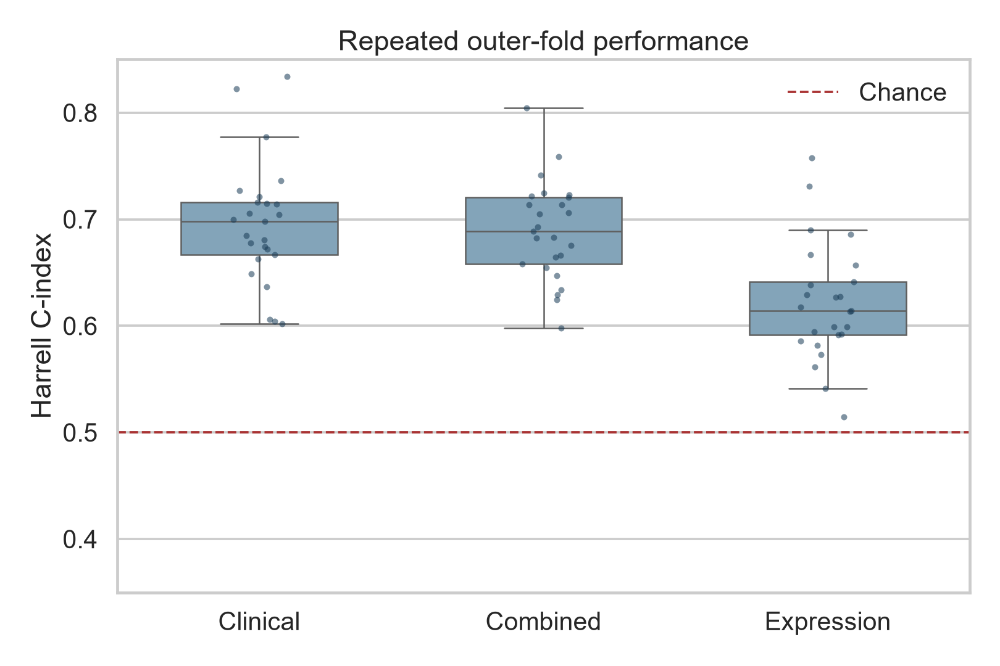
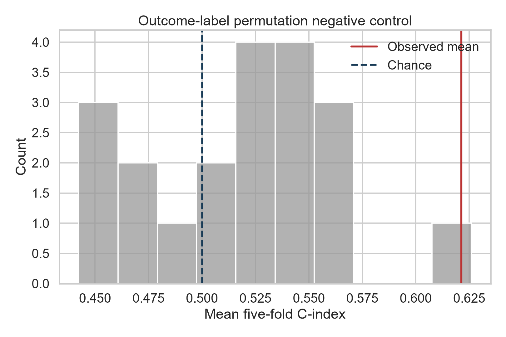
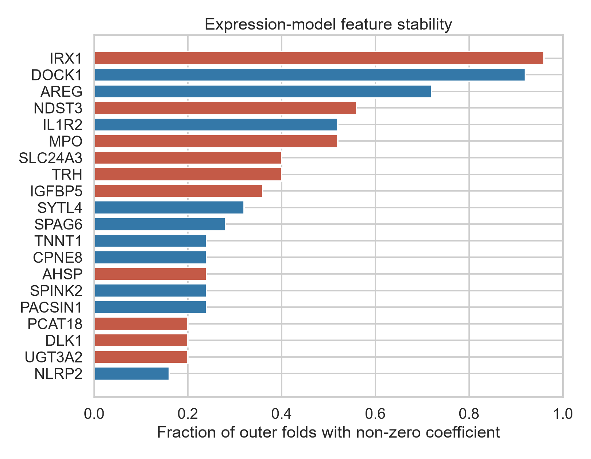
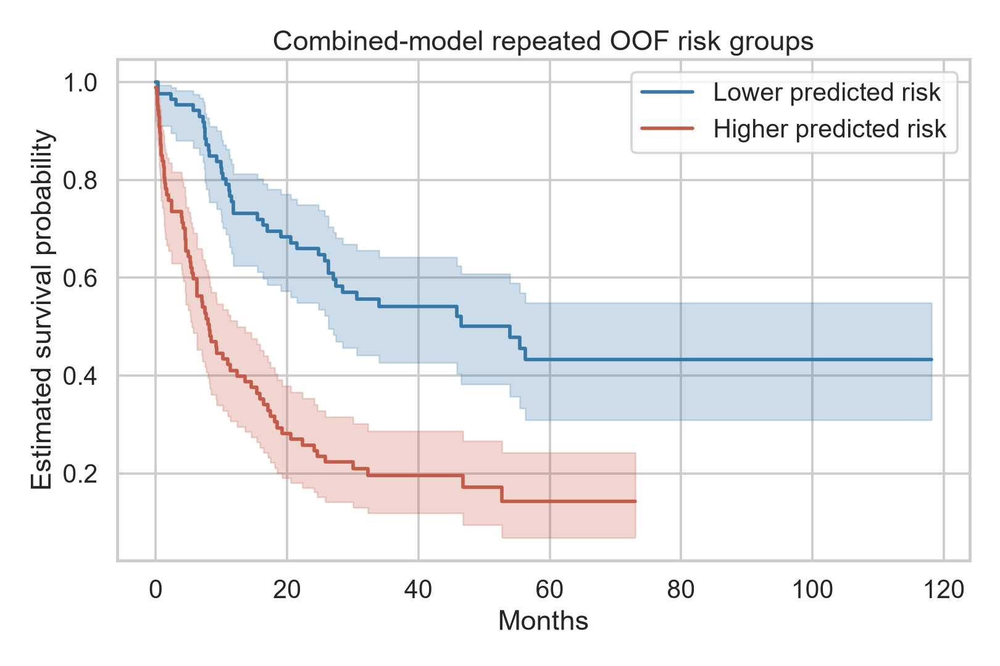

# Stability and incremental value of gene-expression prognostic models in AML

**An AI-assisted reproducibility pilot using public TCGA-LAML data**  
Analysis date: 24 July 2026

## Abstract

### Background

High-dimensional gene-expression models can appear accurate in a small training
sample but fail when applied to new patients. This pilot asked whether baseline
gene expression provided stable overall-survival risk ranking in acute myeloid
leukemia (AML), and whether it added predictive information to a compact
diagnosis-time clinical model.

### Methods

Public, de-identified TCGA-LAML clinical and RNA-sequencing data were obtained
from the cBioPortal DataHub. The analytic cohort included 173 participants with
RNA expression and complete overall-survival outcomes; 114 deaths were
observed. Three Cox models were compared: clinical only, expression only, and
clinical plus expression. Within every training fold, expression was transformed
as `log2(RSEM + 1)`, the 250 most variable genes were selected, missing values
were imputed, predictors were standardized, and elastic-net regularization was
tuned. Performance was measured by Harrell's C-index in five-fold outer
cross-validation repeated five times. Twenty outcome-label permutations served
as a negative control.

### Results

Mean outer-fold C-index was 0.695 for the clinical model, 0.689 for the combined
model, and 0.621 for the expression-only model. The combined model improved on
the clinical model in 10 of 25 outer folds; its mean paired difference was
-0.006. The expression model improved on the clinical model in 4 of 25 folds.
IRX1, DOCK1, and AREG were the most frequently retained expression features,
but stable selection in one cohort does not establish them as validated
biomarkers. Under outcome permutation, the mean five-fold C-index averaged
0.519 and ranged from 0.442 to 0.626; one of 20 permutations equaled or exceeded
the observed expression-model mean.

### Conclusion

Gene expression contained some internal prognostic signal, but it did not
provide a consistent improvement over the clinical baseline in this cohort.
The result illustrates why leakage-resistant validation, negative controls, and
feature-stability reporting are necessary before interpreting statistical
association as clinical usefulness.

## 1. Research question

Among TCGA-LAML participants with baseline RNA sequencing, how stable is an
expression-based overall-survival model under repeated data splitting, and does
adding gene expression improve risk ranking beyond age, sex, WBC, bone-marrow
blast percentage, and cytogenetic risk?

The intended contribution is methodological rather than clinical: demonstrate a
reproducible workflow that can reveal when added molecular complexity does not
translate into reliable incremental prediction.

## 2. Data and cohort

The source study is the TCGA Acute Myeloid Leukemia project. The local analysis
used the `laml_tcga_pub` package distributed through the cBioPortal DataHub.
Source file hashes and sizes are recorded in
`data/processed/manifest.json`, and the distributor's license text is retained
with the raw files.

The source clinical table contained 200 participants; RNA-seq expression was
available for 173. All 173 expression-profiled participants had overall-survival
time and event status and were included.

| Characteristic | Analytic cohort |
|---|---:|
| Participants | 173 |
| Deaths | 114 (65.9%) |
| Censored | 59 (34.1%) |
| Age, years | 58.0 (IQR 44.0–67.0) |
| Male | 92 (53.2%) |
| Female | 81 (46.8%) |
| WBC | 17.0 (IQR 3.4–51.8) |
| Bone-marrow blasts, % | 72.0 (IQR 53.0–86.0) |
| Cytogenetic risk: good/intermediate/poor/unknown | 32 / 101 / 37 / 3 |
| Kaplan–Meier median overall survival | 18.1 months |

No values were missing in the endpoint or the selected clinical predictors in
this downloaded version. The code nevertheless keeps fold-local imputation so
the procedure is explicit and reusable.

## 3. Methods

### 3.1 Endpoint and predictors

The endpoint was overall survival in months, with death as the event and living
participants treated as censored.

The clinical baseline used only variables available at diagnosis:

- age;
- sex;
- `log1p(WBC)`;
- bone-marrow blast percentage;
- cytogenetic risk.

Treatment, induction response, transplantation, and follow-up variables were
excluded to reduce temporal leakage.

For expression, blank gene symbols were removed and duplicated symbols were
collapsed by their within-sample mean. RSEM abundance was transformed as
`log2(x + 1)`. A zero abundance was treated as an observed value, not as
missing.

### 3.2 Models

The clinical model was a ridge-penalized Cox proportional-hazards model. The
expression model was an elastic-net Cox model with `l1_ratio = 0.9`. The combined
model used both predictor sets. In the combined model, clinical coefficients
received 5% of the gene penalty weight so the baseline was largely preserved
without allowing rare clinical categories to create numerical separation.

An initial attempt to leave clinical coefficients completely unpenalized became
numerically unstable in one small inner-training fold. The 5% stabilization
weight is transparently recorded as an analysis-stage numerical decision.

### 3.3 Leakage control and validation

Five-fold outer cross-validation was repeated five times, producing 25 held-out
fold evaluations. Within each outer training set, three-fold inner
cross-validation selected the regularization strength. Every data-dependent
operation was fitted using training observations only:

- numeric and categorical imputation;
- one-hot encoding;
- selection of the 250 most variable genes;
- standardization;
- regularization tuning.

Harrell's C-index was the prespecified primary metric. C-index measures risk
ranking: 0.5 is chance-level ordering, while 1.0 is perfect ordering. It does
not measure calibration, treatment benefit, or clinical utility.

### 3.4 Negative control and feature stability

For the negative control, the paired survival outcome was permuted 20 times and
the expression model was evaluated by five-fold cross-validation using the
median regularization value from the observed-outcome analysis. This was a
descriptive check rather than a fully powered permutation test.

For feature stability, each gene's non-zero coefficient frequency and sign were
recorded across the 25 outer training sets.

## 4. Results

### 4.1 Primary predictive performance

| Model | Mean C-index | SD | Median | Range |
|---|---:|---:|---:|---:|
| Clinical | 0.695 | 0.058 | 0.698 | 0.602–0.834 |
| Combined | 0.689 | 0.046 | 0.689 | 0.598–0.805 |
| Expression | 0.621 | 0.055 | 0.614 | 0.515–0.758 |

Paired on the same outer folds:

- combined minus clinical: mean difference -0.006; combined was better in
  10/25 folds;
- expression minus clinical: mean difference -0.074; expression was better in
  4/25 folds;
- combined minus expression: mean difference +0.068; combined was better in
  22/25 folds.

The primary result is therefore not that gene expression failed to contain any
signal. Rather, its signal was weaker than the clinical baseline and did not
produce a consistent incremental improvement.

Average repeated out-of-fold predictions produced pooled C-indices of 0.697,
0.699, and 0.630 for the clinical, combined, and expression models,
respectively. These pooled values are secondary descriptions; the mean held-out
fold performance above remains the primary result.

### 4.2 Outcome-permutation negative control

The 20 permuted-outcome runs had a mean C-index of 0.519, with permutation means
ranging from 0.442 to 0.626. One permutation equaled or exceeded the observed
expression-model mean of 0.621. The descriptive plus-one permutation proportion
was 2/21, or 0.095.

This small negative-control experiment does not prove that the expression signal
is absent. It shows that apparently respectable C-indices can occasionally
arise under random outcomes in a high-dimensional, small-sample setting.

### 4.3 Feature stability

| Gene | Selected outer folds | Selection rate | Median coefficient sign |
|---|---:|---:|---|
| IRX1 | 24/25 | 0.96 | Negative |
| DOCK1 | 23/25 | 0.92 | Positive |
| AREG | 18/25 | 0.72 | Positive |
| NDST3 | 14/25 | 0.56 | Negative |
| IL1R2 | 13/25 | 0.52 | Positive |
| MPO | 13/25 | 0.52 | Negative |

IRX1 entered the top-variance candidate set in 24 folds and was selected in all
24; DOCK1 was selected in 23 of 25. These are model-stability observations, not
causal claims and not clinically validated biomarker findings. A valid biomarker
claim would require independent cohorts, assay harmonization, biological
support, prespecified thresholds, and clinical comparison.

### 4.4 Descriptive risk groups

A median split of each participant's average repeated out-of-fold combined-model
risk score separated the Kaplan–Meier curves (descriptive log-rank
`p = 1.16 × 10^-8`).

This separation should not be read as evidence that gene expression added
clinical value. The combined score contains the already predictive clinical
variables, and the threshold and plot were generated within the same cohort.
The incremental comparison in Section 4.1 is the relevant result.

## 5. Interpretation

The analysis supports three restrained conclusions:

1. Diagnosis-time clinical variables ranked survival risk moderately well in
   this cohort.
2. Gene expression alone showed an internal signal but was more variable and
   less accurate.
3. Adding 250 variance-filtered expression candidates did not consistently
   outperform the clinical model.

The most useful result is the negative one. A workflow that reported only the
best split, the pooled Kaplan–Meier curve, or the most frequently selected genes
could create a much stronger impression than the repeated held-out results
justify. Repeated nested validation changes the scientific conclusion from
"molecular data predicts AML survival" to "some molecular signal is detectable,
but incremental value is unproven."

## 6. Limitations

- This is a single, relatively small retrospective cohort.
- Internal repeated cross-validation is not external validation.
- TCGA participants and assays may not represent current clinical populations
  or deployment laboratories.
- The compact clinical baseline is not a complete modern AML risk system and
  omits mutation-based classifications.
- The 250-gene variance filter was chosen for computational stability, not
  biological specificity.
- Hyperparameter grids, gene count, and penalty weighting could affect results.
- C-index evaluates discrimination only; calibration and decision benefit were
  not assessed.
- Proportional-hazards assumptions and time-varying effects were not explored in
  depth.
- The permutation analysis used only 20 repetitions and is descriptive.

## 7. Next phase

The next scientifically meaningful step is external validation in an independent
AML expression cohort such as GSE37642. That extension should prespecify:

- compatible adult AML inclusion and endpoint definitions;
- microarray probe-to-gene mapping and duplicate-probe handling;
- training-only model fitting in TCGA with no external retuning;
- cross-platform normalization that does not use external outcomes;
- calibration and time-specific performance;
- comparison with a stronger mutation-aware clinical baseline.

If performance drops materially, that drop is a result rather than a failure.

## 8. Reproducibility and responsible use

The full pipeline, data hashes, fold-level predictions, coefficient histories,
tables, and figures are retained in this project. Run
`scripts/99_quality_checks.py` after reproduction; the current artifacts pass
all checks.

This project was produced with AI assistance as a research prototype. It cannot
be represented as an independently completed student study or as faculty-
supervised work unless the student actually reproduces and understands the
analysis and a faculty member genuinely supervises it. Any academic use should
include an accurate disclosure of contributions.

## References

1. National Cancer Institute. [The Cancer Genome Atlas Program](https://www.cancer.gov/ccg/research/genome-sequencing/tcga).
2. NCI Genomic Data Commons. [TCGA-LAML project](https://portal.gdc.cancer.gov/projects/TCGA-LAML).
3. The Cancer Genome Atlas Research Network. Genomic and epigenomic landscapes
   of adult de novo acute myeloid leukemia. *New England Journal of Medicine*.
   2013;368:2059–2074. [doi:10.1056/NEJMoa1301689](https://doi.org/10.1056/NEJMoa1301689).
4. cBioPortal. [DataHub repository](https://github.com/cBioPortal/datahub).
5. National Center for Biotechnology Information. [GEO series GSE37642](https://www.ncbi.nlm.nih.gov/geo/query/acc.cgi?acc=GSE37642).

